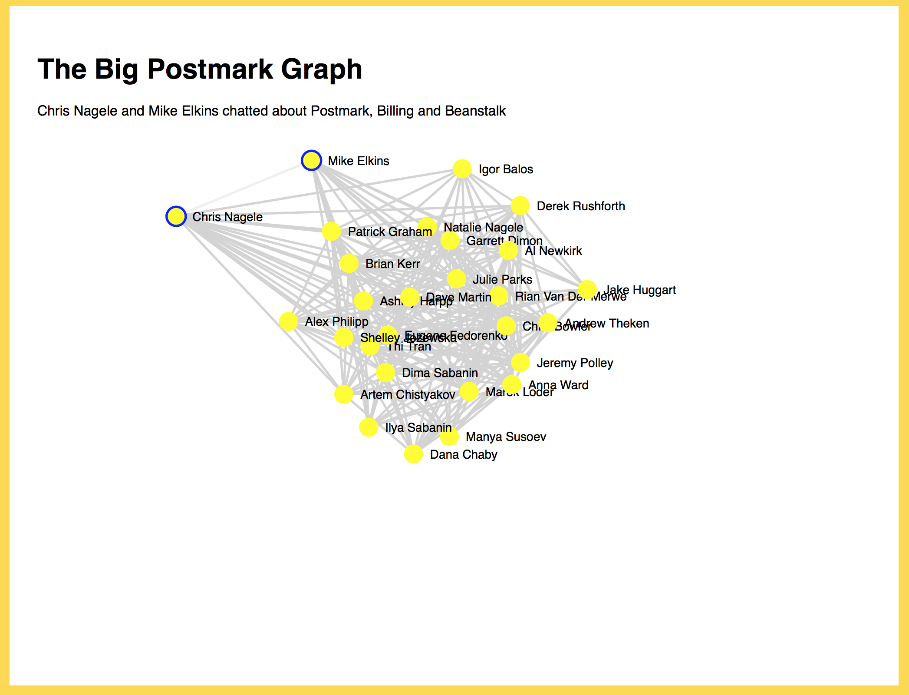

# Postmark Full-Stack Developer Test Project

Hi! Thank you for your interest in the full-stack developer position at ActiveCampaign's Postmark team. We ask that you complete a small test project for us to better understand how you approach problems. It’ll also allow us to appreciate your command of the technologies that we use at work 🙂

## Setting things up

This repository contains a Rails app with a React frontend. To get started, follow these steps:

* `cp .env-example .env` and update the `.env` file with the Postmark Server API token you have been assigned.
* Install the Ruby version found in [.ruby-version](/.ruby-version) (we like to use [RVM](https://rvm.io)).
* Install [NVM](https://github.com/creationix/nvm).
* Run `nvm install` in the repository root.
* Install [Yarn](https://yarnpkg.com/en/docs/install) (required by Webpacker).
* Depending on your platform, you might need to install libsqlite3 for SQLite support.
* Run `bin/setup`.

To verify that your dev environment is set up correctly, run the Rails server and open [http://localhost:3000/](http://localhost:3000/) in your browser.

``` bash
# Running the Rails server

$ bin/rails server
```

Additionally, run the Rake task that you’ll need to modify.

``` bash
$ bin/rake snapshot:take

This Rake task doesn’t do much right now. It’s only got a few pointers to get you started!
```

👋 Drop us a note if you’re having trouble setting it up or if something can be better explained. We’re trying to make this experience as smooth as possible.

## Your assignment

You’re given access to a Postmark server ([?](https://postmarkapp.com/support/article/1105-an-introduction-to-postmark-servers)) used by some 3rd party app to send private message notifications to its users (a common use case for Postmark). The test app will build and present the network of communications within the community of the app’s users.

The app’s boilerplate consists of a Rake task `snapshot:take` that takes a (say, nightly) snapshot of all in-app communications, the `Snapshot` model that stores all in-app communications up to the time it was taken, a Rails controller that serves the latest communications snapshot, and a React view that presents this data to the end user (us 🙂).

#### 1. Modify the `lib/tasks/snapshot.rake` Rake task that creates a snapshot of the in-app communications

Use the [Postmark Messages API](https://github.com/wildbit/postmark-gem/wiki/Messages) to build and save an instance of the `Snapshot` (`app/models/snapshot.rb`) model. Make sure to use *all available* messages for the snapshot. Note that the model doesn’t specify the format of the communications snapshot. Use your own judgment to pick one. Keep in mind that a good data format picked here will save you time on step #2.

#### 2. Modify the React component in `app/javascript/packs/graph.jsx` to show the in-app communications as a graph.

Until your first snapshot is taken, the component will show the data hard-coded in the `graph.jsx` file. Your task is to feed the snapshot data to this React component so that it shows a network of in-app communications where each node is a person and each connection is a message from one person to another. When the user highlights a line connecting two users, the inspector component should display the topics the two chatted about. See the screenshot below for an example.

#### 3. Submit your solution along with a write-up touching on things such as:
- thoughts behind the chosen approach
- any tradeoffs/compromises made



## How we will check assignments

1. We will run `bundle install` and `yarn install` to make sure that the dependencies are up-to-date. We don’t think you’ll need to add any extra dependencies, but you have this option if you miss something.
2. We will take a fresh snapshot using the `bin/rake snapshot:take` command.
3. We will then run `bin/rails server` and open the [http://localhost:3000/](http://localhost:3000/) URL.
4. Once we’re sure that the app works as expected, we’ll take a look at the implementation. See below for what we’re looking at.

First and foremost, we look for a complete and correct implementation of each task listed in the assignment. To increase your chances, make your submission easy to read, follow Ruby and Rails idioms, and use system and network resources efficiently where it matters (but don’t sacrifice readability!).

A note on creativity: feel free to get creative and add a personal touch to your submission. While we don’t filter candidates based on how much work they put into the test project, some extra care can go a long way and even make up for a mistake or a lack of experience in a different area.

Good luck! 🖖
